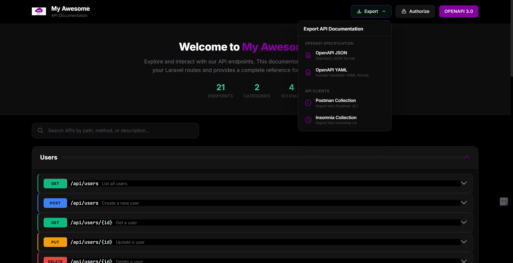

<p align="center">
  
</p>

<p align="center">
  
  <a href="https://packagist.org/packages/stackmasteraliza/laravel-api-response"></a>
  <a href="https://packagist.org/packages/stackmasteraliza/laravel-api-response"></a>
  <a href="https://doi.org/10.5281/zenodo.18204415"></a>
  <a href="https://packagist.org/packages/stackmasteraliza/laravel-api-response"></a>
  <a href="https://laravel-news.com"></a>
  
  
</p>

# Laravel API Toolkit

### `stackmasteraliza/laravel-api-response`

> The all-in-one Laravel API solution: Standardized Responses + Auto-generated Swagger Docs + Export to Postman & Insomnia

A clean and consistent API response builder for Laravel applications. This package provides a simple and elegant way to build standardized JSON responses for your APIs with zero-config OpenAPI documentation.

<p align="center">
  <a href="https://github.com/stackmasteraliza">
    
  </a>
  <br>
  <b>Developed by <a href="https://github.com/stackmasteraliza">Aliza Ali</a></b>
  <br>
  <sub>Creator & Maintainer</sub>
</p>

## Features

- Consistent API response structure
- HTTP status code included in response body
- Fluent interface for building responses
- Built-in methods for common HTTP status codes
- Automatic pagination metadata (including cursor pagination)
- **Auto-generated OpenAPI/Swagger documentation**
- **API versioning support (v1, v2, etc.) with version switcher UI**
- **Built-in WebSocket tester in Swagger UI**
- **Export to Postman, Insomnia, JSON & YAML**
- Response macros for custom response types
- Testing helpers for API assertions
- Exception handler for consistent error responses
- Facade and Trait support
- Fully customizable via config

## Installation

You can install the package via composer:

```bash
composer require stackmasteraliza/laravel-api-response
```

The package will automatically register itself.

### Publish Configuration (Optional)

```bash
php artisan vendor:publish --tag=api-response-config
```

## Usage

### Using the Facade

```php
use Stackmasteraliza\ApiResponse\Facades\ApiResponse;

// Success response
return ApiResponse::success($data, 'Data retrieved successfully');

// Error response
return ApiResponse::error('Something went wrong', 400);

// Created response (201)
return ApiResponse::created($user, 'User created successfully');

// Not found response (404)
return ApiResponse::notFound('User not found');

// Validation error response (422)
return ApiResponse::validationError([
    'email' => ['The email field is required.'],
    'name' => ['The name field is required.'],
]);
```

### Using the Trait

```php
use Stackmasteraliza\ApiResponse\Traits\HasApiResponse;

class UserController extends Controller
{
    use HasApiResponse;

    public function index()
    {
        $users = User::paginate(15);

        return $this->success($users, 'Users retrieved successfully');
    }

    public function store(Request $request)
    {
        $user = User::create($request->validated());

        return $this->created($user, 'User created successfully');
    }

    public function show(User $user)
    {
        return $this->success($user);
    }

    public function destroy(User $user)
    {
        $user->delete();

        return $this->noContent();
    }
}
```

### Available Methods

#### Success Responses

| Method | Status Code | Description |
|--------|-------------|-------------|
| `success($data, $message, $statusCode)` | 200 | General success response |
| `created($data, $message)` | 201 | Resource created |
| `accepted($data, $message)` | 202 | Request accepted for processing |
| `noContent()` | 204 | No content to return |

#### Error Responses

| Method | Status Code | Description |
|--------|-------------|-------------|
| `error($message, $statusCode, $errors)` | Variable | General error response |
| `badRequest($message, $errors)` | 400 | Bad request |
| `unauthorized($message)` | 401 | Unauthorized |
| `forbidden($message)` | 403 | Forbidden |
| `notFound($message)` | 404 | Resource not found |
| `methodNotAllowed($message)` | 405 | Method not allowed |
| `conflict($message, $errors)` | 409 | Conflict |
| `unprocessable($message, $errors)` | 422 | Unprocessable entity |
| `validationError($errors, $message)` | 422 | Validation failed |
| `tooManyRequests($message, $retryAfter)` | 429 | Too many requests |
| `serverError($message)` | 500 | Internal server error |
| `serviceUnavailable($message)` | 503 | Service unavailable |

### Response Structure

#### Success Response

```json
{
    "status_code": 200,
    "success": true,
    "message": "Data retrieved successfully",
    "data": {
        "id": 1,
        "name": "John Doe",
        "email": "john@example.com"
    }
}
```

#### Paginated Response

```json
{
    "status_code": 200,
    "success": true,
    "message": "Users retrieved successfully",
    "data": [
        {"id": 1, "name": "John Doe"},
        {"id": 2, "name": "Jane Doe"}
    ],
    "meta": {
        "current_page": 1,
        "per_page": 15,
        "total": 50,
        "last_page": 4,
        "from": 1,
        "to": 15,
        "path": "http://example.com/api/users",
        "links": {
            "first": "http://example.com/api/users?page=1",
            "last": "http://example.com/api/users?page=4",
            "prev": null,
            "next": "http://example.com/api/users?page=2"
        }
    }
}
```

#### Cursor Paginated Response

Cursor pagination is more efficient for large datasets:

```php
$users = User::cursorPaginate(15);
return ApiResponse::success($users, 'Users retrieved successfully');
```

```json
{
    "status_code": 200,
    "success": true,
    "message": "Users retrieved successfully",
    "data": [
        {"id": 1, "name": "John Doe"},
        {"id": 2, "name": "Jane Doe"}
    ],
    "meta": {
        "per_page": 15,
        "next_cursor": "eyJpZCI6MTUsIl9wb2ludHNUb05leHRJdGVtcyI6dHJ1ZX0",
        "prev_cursor": null,
        "path": "http://example.com/api/users",
        "links": {
            "next": "http://example.com/api/users?cursor=eyJpZCI6MTUuLi4",
            "prev": null
        }
    }
}
```

#### Error Response

```json
{
    "status_code": 422,
    "success": false,
    "message": "Validation failed",
    "errors": {
        "email": ["The email field is required."],
        "name": ["The name field is required."]
    }
}
```

### Exception Handling

To use the built-in exception handler, update your `bootstrap/app.php` (Laravel 11+):

```php
use Stackmasteraliza\ApiResponse\Exceptions\ApiExceptionHandler;

->withExceptions(function (Exceptions $exceptions) {
    $exceptions->render(function (Throwable $e, Request $request) {
        $handler = new ApiExceptionHandler();
        return $handler->handle($e, $request);
    });
})
```

Or for Laravel 10, update your `app/Exceptions/Handler.php`:

```php
use Stackmasteraliza\ApiResponse\Exceptions\ApiExceptionHandler;

public function render($request, Throwable $exception)
{
    $handler = new ApiExceptionHandler();
    $response = $handler->handle($exception, $request);

    if ($response) {
        return $response;
    }

    return parent::render($request, $exception);
}
```

### Middleware

Use the `ForceJsonResponse` middleware to ensure all API responses are JSON:

```php
// In your route file or middleware group
use Stackmasteraliza\ApiResponse\Http\Middleware\ForceJsonResponse;

Route::middleware([ForceJsonResponse::class])->group(function () {
    // Your API routes
});
```

### Adding Custom Data

```php
return ApiResponse::success($user)
    ->withData('token', $token)
    ->withHeader('X-Custom-Header', 'value');
```

### Response Macros

Define reusable custom response types using macros:

```php
// In your AppServiceProvider boot() method
use Stackmasteraliza\ApiResponse\Facades\ApiResponse;

ApiResponse::macro('banned', function (string $reason = 'Account suspended') {
    return $this->error($reason, 403);
});

ApiResponse::macro('maintenance', function () {
    return $this->error('Service under maintenance', 503);
});
```

Usage:

```php
return ApiResponse::banned('Your account has been suspended');
return ApiResponse::maintenance();
```

### Testing Helpers

The package provides convenient testing assertions for your API tests:

```php
use Tests\TestCase;

class UserControllerTest extends TestCase
{
    public function test_can_list_users()
    {
        $response = $this->getJson('/api/users');

        $response->assertApiSuccess()
                 ->assertApiStatusCode(200)
                 ->assertApiMessage('Users retrieved successfully')
                 ->assertApiHasData()
                 ->assertApiPaginated();
    }

    public function test_validation_errors()
    {
        $response = $this->postJson('/api/users', []);

        $response->assertApiError(422)
                 ->assertApiMessage('Validation failed')
                 ->assertApiHasErrors('email');
    }

    public function test_user_data()
    {
        $response = $this->getJson('/api/users/1');

        $response->assertApiSuccess()
                 ->assertApiDataContains(['id' => 1, 'name' => 'John Doe']);
    }
}
```

#### Available Test Assertions

| Method | Description |
|--------|-------------|
| `assertApiSuccess()` | Assert response has `success: true` |
| `assertApiError($statusCode)` | Assert response has `success: false` and optional status code |
| `assertApiStatusCode($code)` | Assert status code in response body |
| `assertApiMessage($message)` | Assert response message |
| `assertApiHasData($key)` | Assert data exists (optionally check for specific key) |
| `assertApiDataCount($count)` | Assert data array has specific count |
| `assertApiData($expected)` | Assert data equals expected array |
| `assertApiDataContains($expected)` | Assert data contains expected subset |
| `assertApiPaginated()` | Assert response has pagination meta |
| `assertApiCursorPaginated()` | Assert response has cursor pagination meta |
| `assertApiHasErrors($key)` | Assert errors exist (optionally check for specific key) |

## OpenAPI/Swagger Documentation

The package automatically generates OpenAPI 3.0 documentation from your API routes with a beautiful, modern dark-themed UI - **no additional coding required!**



### Export to Multiple Formats

Export your API documentation to Postman, Insomnia, JSON, or YAML with a single click.


### Built-in Authorization

Easily configure Bearer Token or API Key authentication directly from the UI.


### WebSocket Tester

Test WebSocket connections directly from the documentation with real-time message sending and receiving.


### Zero-Configuration Auto-Generation

The package intelligently generates documentation by:

- **Detecting ApiResponse method calls** - Scans your controller code for `ApiResponse::success()`, `ApiResponse::created()`, etc. and automatically determines response status codes
- **Extracting FormRequest validation rules** (optional) - If your controller methods use FormRequest classes, validation rules are automatically converted to OpenAPI request body schemas
- **Inferring from route patterns** - Resource controller methods (`index`, `show`, `store`, `update`, `destroy`) get meaningful summaries and descriptions
- **Detecting pagination** - Automatically identifies paginated responses when using `->paginate()` or `->cursorPaginate()`

**No FormRequest or PHP attributes required!** Just write your Laravel code normally and get instant API documentation.

> **Note:** FormRequest classes are completely optional. If you don't use them, the package will still generate documentation - it will just show a generic request body schema for POST/PUT/PATCH endpoints. Using FormRequest simply provides richer, more detailed request body documentation.

### View Documentation

Simply visit `/api-docs` in your browser to see the interactive Swagger UI:

```
http://your-app.com/api-docs
```

### Custom Swagger UI Features

The package includes a beautifully designed custom Swagger UI with:

- **Theme Support** - Dark, Light, and Auto (system preference) themes with toggle button
- **Custom Branding** - Display your app name and logo in the header
- **Hero Section** - Welcome message with live API statistics (endpoints, categories, schemas)
- **Search Bar** - Filter APIs by path, method, or description
- **Authorization Modal** - Support for Bearer Token and API Key authentication with localStorage persistence
- **Export Options** - Export API documentation in multiple formats (JSON, YAML, Postman, Insomnia)
- **Responsive Design** - Works great on desktop and mobile devices
- **Method Badges** - Color-coded HTTP method indicators (GET, POST, PUT, DELETE, PATCH)

### Export API Documentation

Export your API documentation directly from the Swagger UI to import into your preferred tools. Click the **Export** button in the header to access the following formats:

#### OpenAPI Specification
- **OpenAPI JSON** - Standard JSON format compatible with any OpenAPI 3.0 tool
- **OpenAPI YAML** - Human-readable YAML format for easier editing and version control

#### API Client Collections
- **Postman Collection (v2.1)** - Ready to import into Postman with:
  - Organized folders by API tags/categories
  - Pre-configured base URL as collection variable
  - Request bodies with auto-generated example data
  - Query parameters, path variables, and headers

- **Insomnia Collection (v4)** - Ready to import into Insomnia with:
  - Workspace and environment setup
  - Organized request groups by tags
  - Base URL as environment variable
  - Full request configuration

All exports are generated client-side for instant downloads with no server load.

### Customization

Configure the Swagger UI appearance in your `.env` file:

```env
# App branding
API_DOCS_APP_NAME=My Awesome API
API_DOCS_APP_LOGO=https://example.com/logo.png

# Theme color (default: #10b981 - green)
API_DOCS_THEME_COLOR=#10b981

# Default theme: dark, light, or auto (default: auto)
API_DOCS_DEFAULT_THEME=auto

# Enable/disable documentation
API_DOCS_ENABLED=true
```

Or in your config file:

```php
// config/api-response.php

'openapi' => [
    'enabled' => env('API_DOCS_ENABLED', true),
    'title' => env('API_DOCS_TITLE', 'API Documentation'),
    'description' => 'Auto-generated API documentation',
    'version' => '1.0.0',
    'route_prefix' => 'api',
    'docs_route' => 'api-docs',

    // Custom branding
    'app_name' => env('API_DOCS_APP_NAME', env('APP_NAME', 'API')),
    'app_logo' => env('API_DOCS_APP_LOGO', null),
    'theme_color' => env('API_DOCS_THEME_COLOR', '#10b981'),
    'default_theme' => env('API_DOCS_DEFAULT_THEME', 'auto'), // dark, light, auto

    'servers' => [
        ['url' => env('APP_URL'), 'description' => 'API Server'],
    ],
],
```

### API Endpoints

| Endpoint | Description |
|----------|-------------|
| `GET /api-docs` | Interactive Swagger UI |
| `GET /api-docs/openapi.json` | Raw OpenAPI 3.0 specification |

### Generate Static File

Generate a static OpenAPI JSON file:

```bash
php artisan api:docs
```

This creates `public/api-docs/openapi.json` that you can use with any OpenAPI-compatible tool.

### Enhanced Documentation with Attributes (Optional)

For more detailed or customized documentation, you can optionally add PHP attributes to your controller methods:

```php
use Stackmasteraliza\ApiResponse\Attributes\ApiEndpoint;
use Stackmasteraliza\ApiResponse\Attributes\ApiRequest;
use Stackmasteraliza\ApiResponse\Attributes\ApiRequestBody;
use Stackmasteraliza\ApiResponse\Attributes\ApiResponse;

class UserController extends Controller
{
    #[ApiEndpoint(
        summary: 'List all users',
        description: 'Retrieve a paginated list of all users in the system',
        tags: ['Users']
    )]
    #[ApiRequest(name: 'page', type: 'integer', in: 'query', description: 'Page number')]
    #[ApiRequest(name: 'per_page', type: 'integer', in: 'query', description: 'Items per page')]
    #[ApiResponse(status: 200, description: 'Users retrieved successfully', ref: 'PaginatedResponse')]
    public function index(): JsonResponse
    {
        return ApiResponse::success(User::paginate(15));
    }

    #[ApiEndpoint(
        summary: 'Create a new user',
        description: 'Create a new user in the system',
        tags: ['Users']
    )]
    #[ApiRequestBody(
        properties: ['name' => 'string', 'email' => 'string', 'password' => 'string'],
        required: ['name', 'email', 'password'],
        example: ['name' => 'John Doe', 'email' => 'john@example.com', 'password' => 'secret']
    )]
    #[ApiResponse(status: 201, description: 'User created successfully')]
    #[ApiResponse(status: 422, description: 'Validation error', ref: 'ValidationErrorResponse')]
    public function store(Request $request): JsonResponse
    {
        $user = User::create($request->validated());
        return ApiResponse::created($user);
    }
}
```

### Available Attributes

| Attribute | Target | Description |
|-----------|--------|-------------|
| `#[ApiEndpoint]` | Method | Define summary, description, tags, deprecated status |
| `#[ApiRequest]` | Method | Define query/path parameters |
| `#[ApiRequestBody]` | Method | Define request body schema |
| `#[ApiResponse]` | Method | Define response status, description, example |

### Built-in Schema References

Use these in `#[ApiResponse(ref: '...')]`:

- `SuccessResponse` - Standard success response
- `ErrorResponse` - Standard error response
- `PaginatedResponse` - Paginated list response
- `ValidationErrorResponse` - Validation error with field errors

## Configuration

```php
return [
    // Default messages
    'default_success_message' => 'Success',
    'default_error_message' => 'Error',

    // Include debug info in error responses (when APP_DEBUG=true)
    'include_debug_info' => env('API_RESPONSE_DEBUG', false),

    // Include HTTP status code in response body
    'include_status_code' => env('API_RESPONSE_INCLUDE_STATUS_CODE', true),

    // Customize response keys
    'keys' => [
        'success' => 'success',
        'message' => 'message',
        'data' => 'data',
        'errors' => 'errors',
        'meta' => 'meta',
        'status_code' => 'status_code',
    ],
];
```

### Disabling Status Code in Response Body

If you prefer not to include the status code in the response body, you can disable it:

```env
API_RESPONSE_INCLUDE_STATUS_CODE=false
```

Or in your config file:

```php
'include_status_code' => false,
```

### API Versioning

The package supports versioned API documentation. When enabled, it auto-detects version prefixes from your routes (e.g., `api/v1/*`, `api/v2/*`) and generates separate OpenAPI specs for each version with a version switcher in the Swagger UI.

#### Enable Versioning

Add to your `.env` file:

```env
API_DOCS_VERSIONING=true
```

Or in your config file (`config/api-response.php`):

```php
'openapi' => [
    // ... other options

    'versioning' => [
        'enabled' => true,
        'auto_detect' => true,
        'default_version' => 'v2', // Optional: set default version
    ],
],
```

#### Custom Version Definitions

For more control, you can define custom version patterns:

```php
'versioning' => [
    'enabled' => true,
    'auto_detect' => false,
    'default_version' => 'v2',
    'versions' => [
        'v1' => [
            'title' => 'API v1 (Legacy)',
            'description' => 'Legacy API version - deprecated',
            'pattern' => 'api/v1/*',
        ],
        'v2' => [
            'title' => 'API v2 (Current)',
            'description' => 'Current stable API version',
            'pattern' => 'api/v2/*',
        ],
    ],
],
```

#### Versioned Endpoints

When versioning is enabled, the following endpoints become available:

| Endpoint | Description |
|----------|-------------|
| `/api-docs` | Swagger UI with version switcher |
| `/api-docs/openapi.json` | Full OpenAPI spec (all versions) |
| `/api-docs/versions` | List of available versions |
| `/api-docs/v1/openapi.json` | OpenAPI spec for v1 only |
| `/api-docs/v2/openapi.json` | OpenAPI spec for v2 only |

### WebSocket Testing

The Swagger UI includes a built-in WebSocket tester for testing real-time connections directly from the documentation.

#### Features

- Connect to any WebSocket endpoint
- Send and receive messages in real-time
- Pre-built message templates (Subscribe, Unsubscribe, Ping, Client Event)
- Message history with timestamps
- Connection state persistence

#### Configuration

```php
'openapi' => [
    'websocket' => [
        'enabled' => true,
        'url' => env('WEBSOCKET_URL', 'ws://localhost:6001'),
        'endpoints' => [],
    ],
],
```

Click the **WebSocket** button in the Swagger UI header to open the tester.

## Testing

```bash
composer test
```

## Contributing

Contributions are welcome! Please feel free to submit a Pull Request.

## License

The MIT License (MIT). Please see [License File](LICENSE) for more information.
